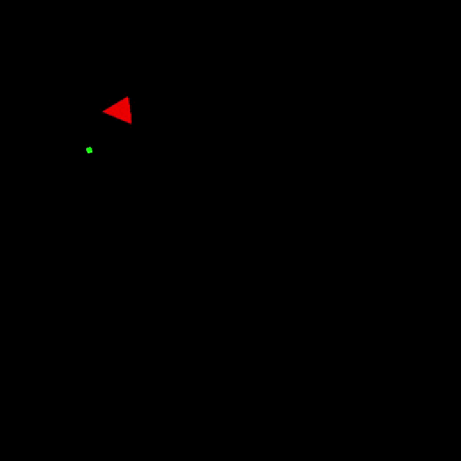

# Boids
Bird-oids flock graphic simulation in C++  

Boids move as a flock following simple rules and aim toward the target (green) while trying to avoid the predator (red).  
When they hit the target, a new one is randomly picked.

This project was made as part of a course from B. Gschwind using a <a href="https://github.com/n-stott/mines">template</a> from N. Stott 
